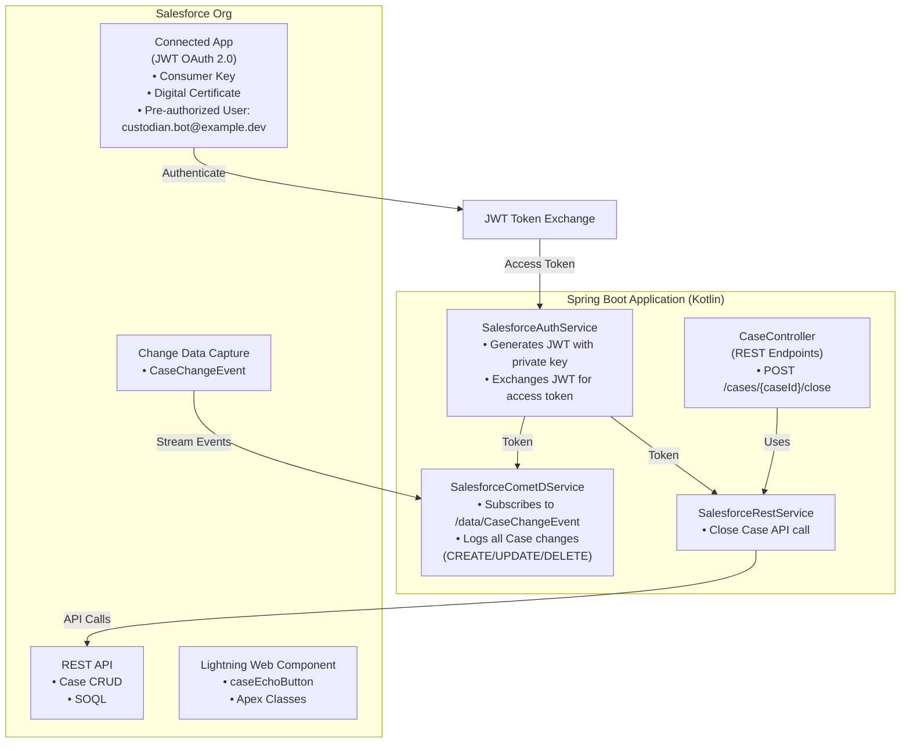
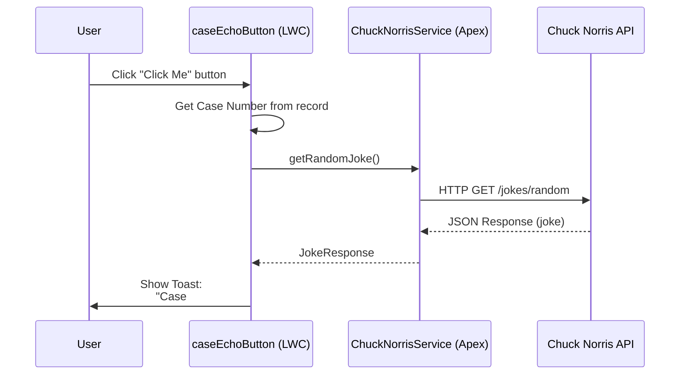

# Salesforce Integration Demo - JWT Server-to-Server Authentication

A proof-of-concept project exploring Salesforce integrations using JWT-based server-to-server authentication, Change Data Capture (CDC), REST API, and Lightning Web Components.

## Table of Contents

- [Project Overview](#project-overview)
- [Architecture](#architecture)
- [Salesforce Setup - What I Did](#salesforce-setup---what-i-did)
- [Backend Application](#backend-application)
- [UI Components](#ui-components)
- [Getting Started](#getting-started)
- [Testing the Integration](#testing-the-integration)
- [Project Structure](#project-structure)
- [Resources](#resources)

## Project Overview

### Purpose

This project was created to explore and demonstrate Salesforce integration patterns using modern server-to-server authentication (JWT Bearer Flow). The goal is to understand how to:

1. Authenticate to Salesforce without user interaction (JWT Bearer Flow)
2. Listen to real-time data changes using Change Data Capture (CDC)
3. Perform REST API operations on Salesforce objects
4. Build and deploy Lightning Web Components that integrate with external APIs

### Technologies

**Backend:**
- **Language**: Kotlin 1.9.25
- **Framework**: Spring Boot 3.5.7
- **Java Version**: Java 21
- **Build Tool**: Maven
- **Key Libraries**:
  - CometD Java Client 3.1.11 (for CDC/Streaming API)
  - Nimbus JOSE JWT 9.37.3 (for JWT token generation)
  - Spring Web (for REST endpoints)

**Salesforce:**
- **Org Type**: Developer Edition
- **API Version**: 59.0
- **Components**:
  - Connected App (OAuth 2.0 JWT Bearer Flow)
  - Change Data Capture on Case object
  - Lightning Web Component with Apex integration
  - Remote Site Settings for external API calls

**Frontend:**
- Lightning Web Components (LWC)
- Apex classes for HTTP callouts
- Chuck Norris API integration (example external API)

### Use Cases Demonstrated

1. **JWT Authentication**: Server-to-server authentication without user login
2. **Real-time Monitoring**: CDC listener for Case object changes
3. **REST Operations**: Close Case functionality via Salesforce REST API
4. **UI Components**: Custom button on Case records with external API integration
5. **External API Callouts**: Apex-based HTTP callouts to public APIs

## Architecture



## Salesforce Setup - What I Did

Here's a detailed walkthrough of every step I took in Salesforce to set up this integration. I'm documenting this as if teaching someone else to replicate the setup.

### Step 1: Created a Developer Edition Org

1. Navigated to https://developer.salesforce.com/signup
2. Filled out the form to create a free Developer Edition org
3. Received confirmation email and verified my account
4. Logged into my new Developer Edition org

**Org Details:**
- Instance URL: https://login.salesforce.com
- Username: (my admin username)
- Edition: Developer Edition
- API Access: Enabled by default

### Step 2: Created a Dedicated Integration User

I created a dedicated "bot" user specifically for the integration, following the principle of least privilege and making it easy to track API usage.

**Navigation:** Setup → Users → New User

**User Details I Configured:**
- **First Name**: Custodian
- **Last Name**: Bot
- **Email**: custodian.bot@example.dev (you should use a real email you control)
- **Username**: custodian.bot@example.dev
- **Alias**: custbot
- **Nickname**: custodianbot
- **User License**: Salesforce
- **Profile**: System Administrator (for this demo; in production, use a more restricted profile)

**Why a dedicated user?**
- Easy to track API calls and changes made by the integration
- Can be deactivated without affecting real users
- Follows security best practices for service accounts

**Important:** I saved the user but noted that I'd need to set a password or use JWT (which bypasses password requirement).

### Step 3: Generated Certificate and Private Key

For JWT Bearer Flow, I needed a certificate/private key pair. I used OpenSSL on my local machine.

**Commands I ran:**

```bash
# Navigate to resources directory
cd src/main/resources

# Generate private key (2048-bit RSA)
openssl genrsa -out sf-jwt-private.key 2048

# Generate certificate signing request (CSR)
openssl req -new -key sf-jwt-private.key -out sf-jwt.csr

# Generate self-signed certificate (valid for 365 days)
openssl x509 -req -days 365 -in sf-jwt.csr -signkey sf-jwt-private.key -out sf-jwt-public.crt
```

**When prompted for certificate details, I entered:**
- Country: US
- State: (my state)
- City: (my city)
- Organization: Personal Project
- Organizational Unit: Integration
- Common Name: salesforce-demo
- Email: (my email)

**Result:** I now had two files:
- `sf-jwt-private.key` - Private key (keep secret, used by backend)
- `sf-jwt-public.crt` - Public certificate (upload to Salesforce)

### Step 4: Created a Connected App

Connected Apps are how external applications authenticate with Salesforce.

**Navigation:** Setup → App Manager → New Connected App

**Connected App Configuration:**

**Basic Information:**
- **Connected App Name**: Salesforce Demo Integration
- **API Name**: Salesforce_Demo_Integration
- **Contact Email**: (my email)
- **Description**: JWT-based server-to-server integration for demo project

**API (Enable OAuth Settings):**
- ✅ **Enable OAuth Settings** (checked)
- **Callback URL**: `http://localhost:8080/callback`
  - (Not used in JWT flow, but required field)
- ✅ **Use digital signatures** (checked)
  - Clicked "Choose File" and uploaded `sf-jwt-public.crt`
- **Selected OAuth Scopes**: I added these scopes:
  - ✅ Access and manage your data (api)
  - ✅ Perform requests on your behalf at any time (refresh_token, offline_access)
  - ✅ Access the identity URL service (id)
  - ✅ Access unique user identifiers (openid)

**Additional Settings:**
- ✅ **Enable Client Credentials Flow** (unchecked - not needed for JWT)
- **Permitted Users**: Admin approved users are pre-authorized (selected this)
  - This is crucial for JWT flow - only pre-authorized users can use it

**Clicked Save**, then waited 2-10 minutes for the Connected App to propagate.

### Step 5: Retrieved Connected App Credentials

After the Connected App was created, I needed the Consumer Key (Client ID).

**Navigation:** Setup → App Manager → Find "Salesforce Demo Integration" → View

**Clicked "Manage Consumer Details"** (had to verify my identity)

**Credentials I Retrieved:**
- **Consumer Key**: `3MVG97L7PWbPq6Uz_RALb6O1RF5fn1wDxiF_15HtPXA0IArecr3xj2mw7KyKwGBnEcdq35h2pbazb7K0xvAQC`
  - This is the Client ID used in JWT authentication
- **Consumer Secret**: (not needed for JWT flow, but noted for reference)

I copied the Consumer Key and saved it in `.env.local` as `SALESFORCE_CONSUMER-KEY`.

### Step 6: Pre-Authorized the Bot User in Connected App

For JWT flow to work, I had to explicitly pre-authorize my bot user to use the Connected App.

**Navigation:** Setup → App Manager → Find "Salesforce Demo Integration" → Manage

**Scrolled down to "Managed Connected Apps"** section, then:

1. Clicked **"Manage"** next to the Connected App name
2. Scrolled to **"OAuth Policies"** section
3. **Permitted Users**: Verified it was set to "Admin approved users are pre-authorized"
4. Clicked **"Save"**

**Then, I configured the Profile/Permission Set assignment:**

5. Scrolled to **"Profiles"** section at the bottom
6. Clicked **"Manage Profiles"**
7. Selected the profiles that can use this Connected App:
   - ✅ System Administrator (checked)
8. Clicked **"Save"**

**Alternative (using Permission Sets - more granular control):**

I also created a dedicated Permission Set:

**Navigation:** Setup → Permission Sets → New

**Permission Set Details:**
- **Label**: Salesforce Demo Integration Access
- **API Name**: Salesforce_Demo_Integration_Access
- **Description**: Grants access to use the Salesforce Demo Integration Connected App

**After creating, I:**
1. Clicked on the Permission Set
2. Went to **"Assigned Connected Apps"**
3. Clicked **"Edit"**
4. Added **"Salesforce Demo Integration"** to Enabled Connected Apps
5. Clicked **"Save"**

**Then assigned it to my bot user:**

**Navigation:** Setup → Users → Find "Custodian Bot" → Permission Set Assignments → Edit Assignments

- Selected **"Salesforce Demo Integration Access"**
- Clicked **"Add"** and **"Save"**

### Step 7: Enabled API Access for the User

I verified that my bot user had API access enabled.

**Navigation:** Setup → Users → Find "Custodian Bot" → Edit

**Checked:**
- ✅ **Profile has "API Enabled" permission** (System Administrator profile has this by default)

**Also verified in Profile:**

**Navigation:** Setup → Profiles → System Administrator → System Permissions

- ✅ **API Enabled** (checked)

### Step 8: Enabled Change Data Capture for Case Object

To receive real-time notifications when Cases change, I enabled CDC.

**Navigation:** Setup → Integrations → Change Data Capture

**In the Available Entities list:**
1. Found **"Case"** in the left column
2. Clicked the arrow to move it to **"Selected Entities"**
3. Clicked **"Save"**

**Result:** Salesforce now publishes change events to the `/data/CaseChangeEvent` channel whenever a Case is created, updated, or deleted.

### Step 9: Configured Security Settings (If Needed)

Depending on your org's security settings, you may need to adjust these:

**Trusted IP Ranges (Optional):**

If you want to restrict where the integration can connect from:

**Navigation:** Setup → Security → Network Access → New

- **Start IP Address**: (your server's IP or range)
- **End IP Address**: (your server's IP or range)

**For development, I skipped this** to allow connections from anywhere.

**Session Settings:**

**Navigation:** Setup → Security → Session Settings

Verified:
- **Lock sessions to the IP address from which they originated**: Unchecked (for flexibility)
- **Enforce login IP ranges on every request**: Unchecked (for development)

### Step 10: Tested Authentication

Before running the full application, I verified the setup by testing JWT token generation.

**Using Postman or curl:**

```bash
# Generate JWT (done by Spring Boot app)
# Exchange JWT for access token

curl -X POST https://login.salesforce.com/services/oauth2/token \
  -d "grant_type=urn:ietf:params:oauth:grant-type:jwt-bearer" \
  -d "assertion=<JWT_TOKEN_HERE>"
```

**Expected response:**
```json
{
  "access_token": "00D...",
  "scope": "api id openid",
  "instance_url": "https://yourinstance.my.salesforce.com",
  "id": "https://login.salesforce.com/id/00D.../005...",
  "token_type": "Bearer"
}
```

**If I got an error**, I checked:
- Certificate uploaded correctly in Connected App
- Bot user pre-authorized in Connected App
- Consumer Key correct in .env.local
- JWT claims (issuer, subject, audience) correct

### Step 11: Created Test Cases

To test the CDC listener and REST API, I created some test Cases.

**Navigation:** App Launcher → Cases → New

**Created a few test cases with:**
- **Subject**: Test Case 1, Test Case 2, etc.
- **Status**: New
- **Origin**: Web

These would trigger CDC events that my Spring Boot app would receive.

### Step 12: Deployed Lightning Web Component

For the UI component, I created a Lightning Web Component that calls an external API.

**See detailed steps in:** `salesforce-metadata/README.md`

**Summary of what I did:**
1. Created LWC component with Apex class for external callout
2. Created Remote Site Settings to whitelist external API
3. Deployed using Salesforce CLI:
   ```bash
   cd salesforce-metadata
   sf org login web --alias myDevOrg
   sf project deploy start --source-dir force-app
   ```
4. Added component to Case Lightning Record page via Lightning App Builder

## Backend Application

### Overview

The Spring Boot backend application (written in Kotlin) handles:
1. JWT-based authentication with Salesforce
2. Real-time CDC event streaming
3. REST API operations on Salesforce objects

### Key Components

#### SalesforceAuthService.kt

Handles OAuth 2.0 JWT Bearer Flow authentication.

**Key Methods:**
- `generateJWT()`: Creates a signed JWT with required claims
- `getAccessToken()`: Exchanges JWT for Salesforce access token
- Automatically refreshes tokens when expired

**JWT Claims:**
- **Issuer (iss)**: OAuth Client ID (Consumer Key)
- **Subject (sub)**: Salesforce username (custodian.bot@example.dev)
- **Audience (aud)**: https://login.salesforce.com (or test.salesforce.com for sandboxes)
- **Expiration**: 3 minutes (short-lived for security)

**Configuration (.env.local):**
```env
SALESFORCE_CONSUMER-KEY=3MVG97L7PWbPq6Uz_RALb6O1RF5fn1wDxiF_15HtPXA0IArecr3xj2mw7KyKwGBnEcdq35h2pbazb7K0xvAQC
SALESFORCE_USERNAME=custodian.bot@example.dev
SALESFORCE_LOGIN-URL=https://login.salesforce.com
SALESFORCE_API-VERSION=59.0
```

#### SalesforceCometDService.kt

Implements CDC event listener using CometD (Bayeux) protocol.

**Features:**
- Connects to Salesforce Streaming API
- Subscribes to `/data/CaseChangeEvent` channel
- Logs all Case changes with detailed information
- Automatically reconnects on disconnection

**Event Data Captured:**
- Change Type (CREATE, UPDATE, DELETE)
- Entity Name (Case)
- Changed Fields
- Record IDs
- Replay ID (for event replay)

**Console Output Example:**
```
CDC Event Received:
- Change Type: CREATE
- Entity: Case
- Record IDs: [5000...]
- Changed Fields: [Status, Subject, Origin]
```

#### SalesforceRestService.kt

Handles REST API operations on Salesforce.

**Current Functionality:**
- `closeCase(caseId: String)`: Updates Case status to "Closed"

**API Request:**
```
PATCH /services/data/v59.0/sobjects/Case/{caseId}
Content-Type: application/json
Authorization: Bearer {access_token}

{
  "Status": "Closed"
}
```

#### CaseController.kt

REST controller exposing backend endpoints.

**Endpoints:**
- `POST /cases/{caseId}/close`: Close a Case by ID

**Example Usage:**
```bash
curl -X POST http://localhost:8080/cases/5001234567890/close
```

**Response:**
```json
{
  "message": "Case closed successfully",
  "caseId": "5001234567890"
}
```

### Running the Application

1. **Ensure JWT keys exist:**
   ```bash
   ls src/main/resources/sf-jwt-*.key
   ls src/main/resources/sf-jwt-*.crt
   ```

2. **Configure .env.local:**
   - Set `SALESFORCE_CONSUMER-KEY` to your Consumer Key
   - Set `SALESFORCE_USERNAME` to your bot user
   - Set `SALESFORCE_LOGIN-URL` to https://login.salesforce.com
   - Set `SALESFORCE_API-VERSION` to 59.0

3. **Build and run:**
   ```bash
   mvn clean install
   mvn spring-boot:run
   ```

4. **Verify authentication:**
   - Look for "Successfully authenticated with Salesforce" in logs
   - CDC listener should connect and subscribe to CaseChangeEvent

5. **Test CDC:**
   - Create/update a Case in Salesforce
   - Check console logs for CDC event details

## UI Components

### Lightning Web Component: caseEchoButton

A custom button on Case record pages that:
1. Retrieves the current Case Number
2. Calls the Chuck Norris API (via Apex)
3. Displays a toast notification combining both

**Component Architecture:**



**Files:**
- **LWC**: `salesforce-metadata/force-app/main/default/lwc/caseEchoButton/`
  - `caseEchoButton.html` - UI template
  - `caseEchoButton.js` - Controller logic
  - `caseEchoButton.js-meta.xml` - Metadata
- **Apex**: `salesforce-metadata/force-app/main/default/classes/`
  - `ChuckNorrisService.cls` - HTTP callout logic
  - `ChuckNorrisService.cls-meta.xml` - Metadata
- **Remote Site**: `salesforce-metadata/force-app/main/default/remoteSiteSettings/`
  - `ChuckNorrisAPI.remoteSite-meta.xml` - API authorization

**Deployment:**
```bash
cd salesforce-metadata
sf org login web --alias myDevOrg
sf project deploy start --source-dir force-app
```

**See full deployment guide:** `salesforce-metadata/README.md`

## Getting Started

### Prerequisites

1. **Java 21** installed
   ```bash
   java -version  # Should be 21+
   ```

2. **Maven** installed
   ```bash
   mvn -version
   ```

3. **Salesforce Developer Edition Org** (created above)

4. **Salesforce CLI** (for deploying LWC)
   ```bash
   npm install -g @salesforce/cli
   sf --version
   ```

### Setup

**Configuration Note:** This project uses environment variables defined in `.env.local` for Salesforce configuration. The application automatically loads these variables at startup. Never commit `.env.local` to version control.

1. **Clone this repository** (or create from scratch following this guide)

2. **Generate JWT keys** (if not already done):
   ```bash
   cd src/main/resources
   openssl genrsa -out sf-jwt-private.key 2048
   openssl req -new -key sf-jwt-private.key -out sf-jwt.csr
   openssl x509 -req -days 365 -in sf-jwt.csr -signkey sf-jwt-private.key -out sf-jwt-public.crt
   ```

3. **Configure Connected App** in Salesforce (see "Salesforce Setup" section)

4. **Create .env.local file** in project root:
   ```env
   SALESFORCE_CONSUMER-KEY=YOUR_CONSUMER_KEY
   SALESFORCE_USERNAME=YOUR_BOT_USER_USERNAME
   SALESFORCE_LOGIN-URL=https://login.salesforce.com
   SALESFORCE_API-VERSION=59.0
   ```

   **Variable Descriptions:**
   - `SALESFORCE_CONSUMER-KEY`: Consumer Key from your Connected App (from Step 5 of Salesforce Setup)
   - `SALESFORCE_USERNAME`: Your bot user's username (e.g., custodian.bot@example.dev)
   - `SALESFORCE_LOGIN-URL`: Authentication endpoint (use https://test.salesforce.com for sandboxes)
   - `SALESFORCE_API-VERSION`: Salesforce API version to use

   **Important:** Add `.env.local` to your `.gitignore` to prevent committing sensitive credentials!

5. **Build the application**:
   ```bash
   mvn clean install
   ```

6. **Run the application**:
   ```bash
   mvn spring-boot:run
   ```

7. **Deploy Lightning Web Component** (optional):
   ```bash
   cd salesforce-metadata
   sf org login web --alias myDevOrg
   sf project deploy start --source-dir force-app
   ```

## Testing the Integration

### Test 1: JWT Authentication

**What to check:**
- Application starts without errors
- Console shows: "Successfully authenticated with Salesforce"
- Access token is retrieved

**Troubleshooting:**
- If "invalid_grant" error: Check certificate, Consumer Key, username
- If "user hasn't approved this consumer": Check pre-authorization in Connected App

### Test 2: CDC Event Streaming

**Steps:**
1. Ensure application is running
2. In Salesforce, create a new Case
3. Check console logs for CDC event

**Expected Output:**
```
CDC Event Received:
- Change Type: CREATE
- Entity: Case
- Record IDs: [500...]
- Changed Fields: [Status, Subject, Origin, ...]
```

**Troubleshooting:**
- If no events: Check that Case is in "Selected Entities" in CDC settings
- If connection fails: Check network connectivity and authentication

### Test 3: Close Case API

**Using curl:**
```bash
curl -X POST http://localhost:8080/cases/YOUR_CASE_ID/close
```

**Using Postman:**
- Method: POST
- URL: http://localhost:8080/cases/YOUR_CASE_ID/close
- No body required

**Expected:**
- Response: `{"message": "Case closed successfully", "caseId": "..."}`
- In Salesforce: Case Status changes to "Closed"
- CDC event logged showing UPDATE with Status change

### Test 4: Lightning Web Component

**Steps:**
1. Deploy component: `cd salesforce-metadata && sf project deploy start --source-dir force-app`
2. Add to Case Lightning page via Setup → Edit Page
3. Navigate to a Case record
4. Click "Click Me" button
5. See toast notification with Case Number and Chuck Norris fact

**Expected:**
- Loading spinner appears
- Toast shows: "Case #00001234 - [Chuck Norris fact]"
- Toast stays visible (sticky mode)

## Project Structure

```
salesforce-demo/
├── src/
│   ├── main/
│   │   ├── kotlin/com/example/salesforcedemo/
│   │   │   ├── SalesforceDemoApplication.kt      # Main Spring Boot app
│   │   │   ├── SalesforceAuthService.kt          # JWT authentication
│   │   │   ├── SalesforceCometDService.kt        # CDC listener
│   │   │   ├── SalesforceRestService.kt          # REST API operations
│   │   │   ├── CaseController.kt                 # REST endpoints
│   │   │   ├── CdcListenerRunner.kt              # Auto-start CDC listener
│   │   │   ├── CloseCaseRequest.kt               # DTOs
│   │   │   └── CloseCaseResponse.kt
│   │   └── resources/
│   │       ├── application.properties            # Spring Boot config
│   │       ├── sf-jwt-private.key                # Private key (keep secret!)
│   │       └── sf-jwt-public.crt                 # Public certificate
│   └── test/
│       └── kotlin/...                            # Unit tests
├── salesforce-metadata/                          # Salesforce UI components
│   ├── force-app/main/default/
│   │   ├── classes/                              # Apex classes
│   │   │   ├── ChuckNorrisService.cls
│   │   │   └── ChuckNorrisService.cls-meta.xml
│   │   ├── lwc/                                  # Lightning Web Components
│   │   │   └── caseEchoButton/
│   │   │       ├── caseEchoButton.html
│   │   │       ├── caseEchoButton.js
│   │   │       └── caseEchoButton.js-meta.xml
│   │   └── remoteSiteSettings/                   # External API auth
│   │       └── ChuckNorrisAPI.remoteSite-meta.xml
│   ├── sfdx-project.json                         # SFDX config
│   ├── .forceignore                              # Deployment exclusions
│   └── README.md                                 # LWC deployment guide
├── .env.local                                    # Environment variables (Salesforce config)
├── pom.xml                                       # Maven dependencies
├── CLAUDE.md                                     # Project notes
└── README.md                                     # This file
```

## Key Learnings

### JWT Bearer Flow

**Advantages:**
- No user login required (server-to-server)
- Secure (uses certificate-based authentication)
- No password storage needed
- Easy to automate and scale

**Requirements:**
- Connected App with digital certificate
- User must be pre-authorized in Connected App
- Private key must be kept secure
- JWT must be properly signed and have correct claims

### Change Data Capture

**Advantages:**
- Real-time notifications (near-instantaneous)
- Efficient (only sends changes, not full records)
- Reliable (built-in replay mechanism)
- Scalable (handles high volume)

**Limitations:**
- 3-day event retention (use Replay ID to catch up)
- Requires API access
- Not all objects support CDC

### Lightning Web Components

**Advantages:**
- Modern, standards-based framework
- Better performance than Aura
- Easy to build and maintain
- Strong IDE support

**For External API Calls:**
- Cannot call APIs directly from JavaScript (CORS/CSP restrictions)
- Must use Apex as proxy layer
- Requires Remote Site Settings
- Imperative Apex calls (not @wire) for HTTP callouts

## Resources

### Salesforce Documentation

- [JWT Bearer Flow](https://help.salesforce.com/s/articleView?id=sf.remoteaccess_oauth_jwt_flow.htm)
- [Change Data Capture Developer Guide](https://developer.salesforce.com/docs/atlas.en-us.change_data_capture.meta/change_data_capture/)
- [REST API Developer Guide](https://developer.salesforce.com/docs/atlas.en-us.api_rest.meta/api_rest/)
- [Lightning Web Components Developer Guide](https://developer.salesforce.com/docs/component-library/documentation/en/lwc)
- [Apex Developer Guide](https://developer.salesforce.com/docs/atlas.en-us.apexcode.meta/apexcode/)

### Spring Boot & Kotlin

- [Spring Boot Documentation](https://docs.spring.io/spring-boot/docs/current/reference/html/)
- [Kotlin Documentation](https://kotlinlang.org/docs/home.html)

### Tools

- [Salesforce CLI](https://developer.salesforce.com/docs/atlas.en-us.sfdx_setup.meta/sfdx_setup/)
- [Workbench](https://workbench.developerforce.com/) - Web-based Salesforce development tool
- [Postman](https://www.postman.com/) - API testing

### Related Projects

- [CometD Java Client](https://docs.cometd.org/current/reference/#_java_client)
- [Nimbus JOSE + JWT](https://connect2id.com/products/nimbus-jose-jwt)

## Troubleshooting

### Common Issues

**"invalid_grant" error during JWT authentication:**
- Verify certificate uploaded correctly in Connected App
- Check that Consumer Key matches
- Ensure username is correct
- Confirm user is pre-authorized in Connected App
- Verify JWT claims (issuer, subject, audience)

**CDC events not received:**
- Check Change Data Capture settings (Setup → Change Data Capture)
- Verify Case is in "Selected Entities"
- Ensure application authenticated successfully
- Check network connectivity

**Lightning Web Component doesn't appear:**
- Verify deployment succeeded: `sf project deploy report`
- Check component metadata has correct targets
- Refresh Lightning App Builder
- Ensure editing correct object page (Case)

**Chuck Norris API callout fails:**
- Verify Remote Site Settings deployed
- Check Setup → Security → Remote Site Settings
- Ensure ChuckNorrisAPI is Active
- Review debug logs for detailed error

### Debug Logs

**Enable Spring Boot debug logging:**
```properties
# In application.properties
logging.level.com.example.salesforcedemo=DEBUG
```

**Enable Salesforce Debug Logs:**
1. Setup → Debug Logs
2. Click "New" under User Trace Flags
3. Select your bot user
4. Set Debug Level to FINEST
5. Reproduce issue
6. View logs in Debug Logs list

## Security Considerations

**Important Security Notes:**

1. **Private Key**: NEVER commit `sf-jwt-private.key` to version control
   - Add to `.gitignore`
   - Store securely (vault, secrets manager)

2. **Consumer Key**: Treat as sensitive credential
   - Don't hardcode in source files
   - Use environment variables in production

3. **Bot User**:
   - Use principle of least privilege
   - Create custom profile with only needed permissions
   - Regularly audit API usage

4. **Network Security**:
   - Use IP restrictions in production
   - Enable session security settings
   - Monitor login history

## Contributing

This is a personal learning project, but feel free to:
- Fork and experiment
- Submit issues for bugs
- Suggest improvements

## License

This project is for educational purposes. Use at your own risk.

## Acknowledgments

- Salesforce Developer Documentation
- Spring Boot team
- CometD project
- Chuck Norris API (for being awesome)

---

**Created by:** Erfang Chen
**Date:** January 2025
**Purpose:** Exploring Salesforce integrations with modern authentication patterns
